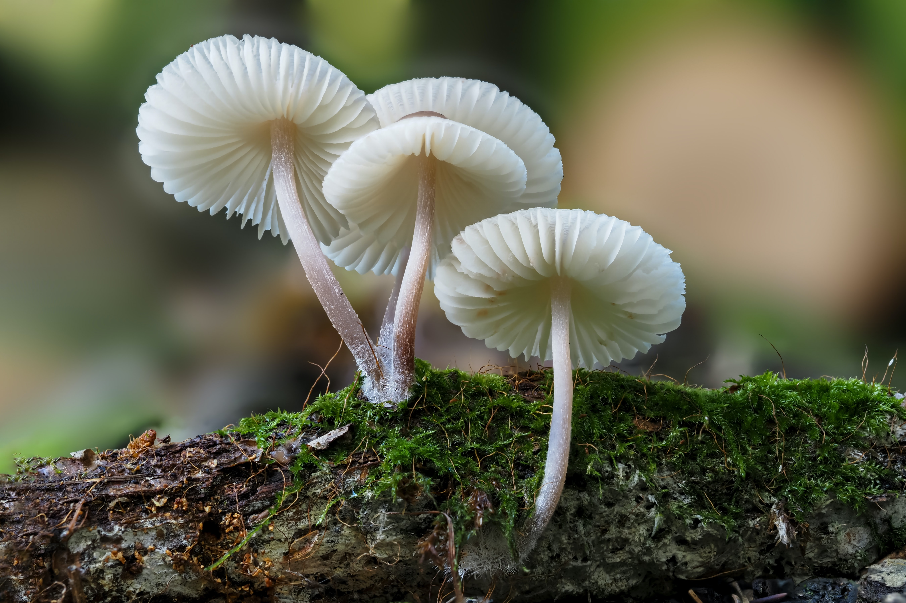

# Exploring Mushrooms
When asked to think of a mushroom, you might imagine the following:

It’s a beige, convex mushroom top with a uniform, thick stem. Maybe you thought of it cut up on a slice of delicious pizza or braised with sauce over rice. Regardless, you most likely did not consider this:

Mushrooms exist in a variety of different colors, shapes, sizes, textures, etc. In this project, we will analyze an extensive mushroom dataset from UCI using bar charts and acquaint ourselves with the diverse array of mushrooms that exist worldwide.
